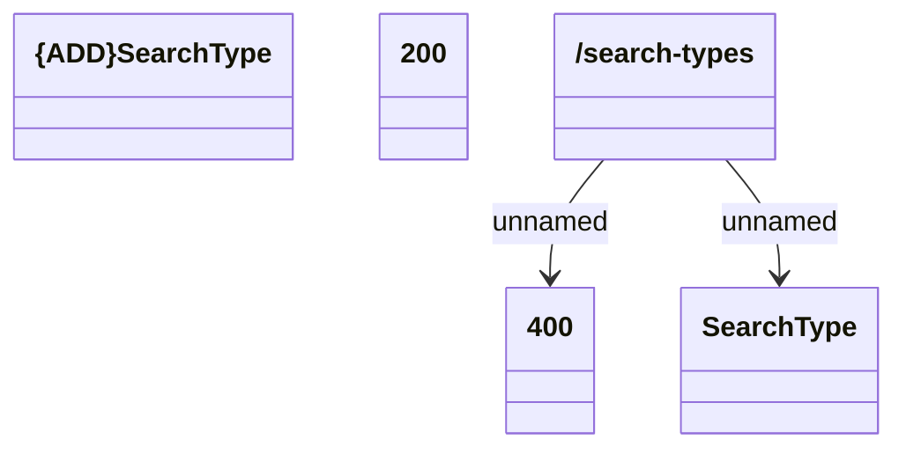

# listSearchTypes

```mermaid
classDiagram
    class ADD_SearchType["{ADD}SearchType"]
    class SearchType["SearchType"]
    class n_200["200"]
    class n_400["400"]
    class search_types["/search-types"]
    search_types --> n_400 : unnamed
    search_types --> SearchType : unnamed
```
