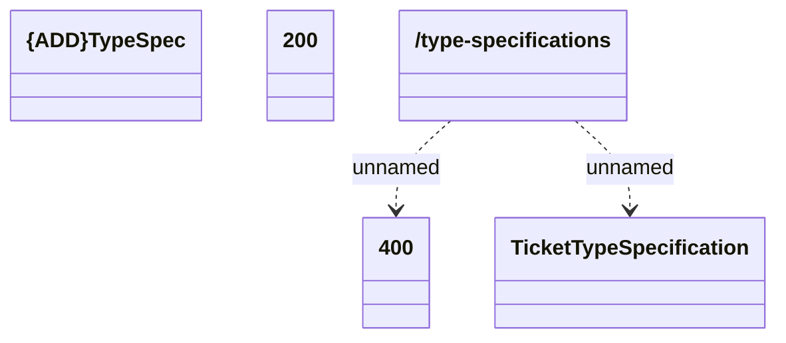

# listTypeSpecifications

- **Diagram Type**: Logical
- **Package**: HomerSelect/BSL/Modules/Ticketing (TCK)/Interface Provided/Web Services/Ticketing API/types/listTypeSpecifications
- **Diagram ID**: 159970
- **Elements**: 5
- **Connectors**: 2

