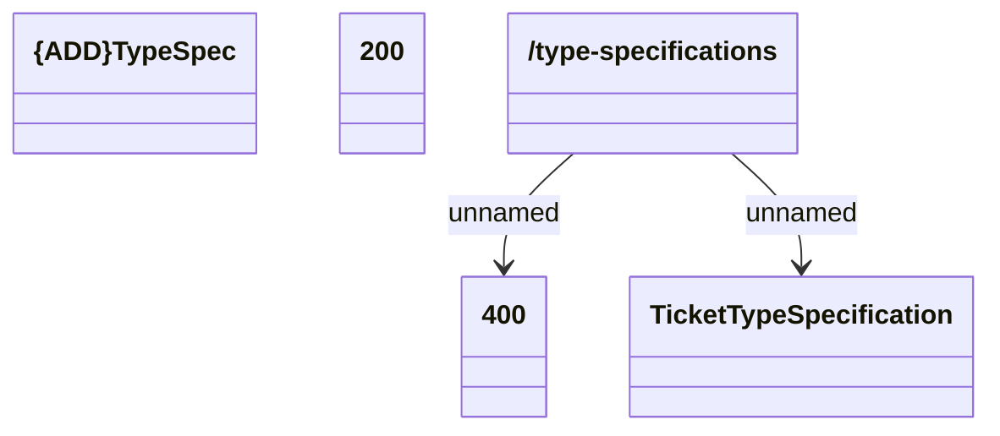

# listTypeSpecifications

```mermaid
classDiagram
    class ADD_TypeSpec["{ADD}TypeSpec"]
    class TicketTypeSpecification["TicketTypeSpecification"]
    class n_400["400"]
    class n_200["200"]
    class type_specifications["/type-specifications"]
    type_specifications --> n_400 : unnamed
    type_specifications --> TicketTypeSpecification : unnamed
```
