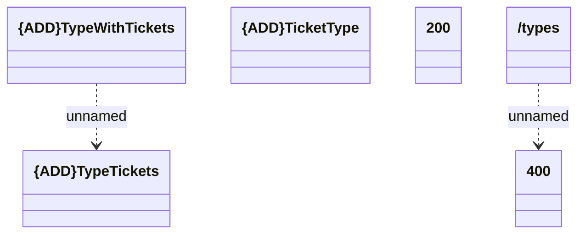

# listTypes

- **Diagram Type**: Logical
- **Package**: HomerSelect/BSL/Modules/Ticketing (TCK)/Interface Provided/Web Services/Ticketing API/types/listTypes
- **Diagram ID**: 159966
- **Elements**: 6
- **Connectors**: 2

