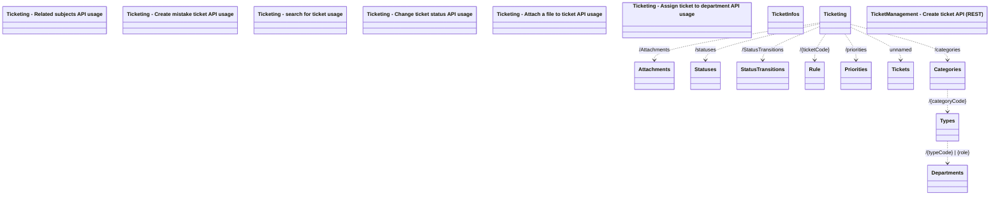

# Ticketing API overview

- **Diagram Type**: Logical
- **Package**: HomerSelect/BSL/Modules/Ticketing (TCK)/Interface Provided/Web Services/Version 1
- **Diagram ID**: 159972
- **Elements**: 18
- **Connectors**: 9

