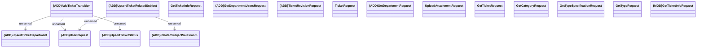

# Request Parameters

```mermaid
classDiagram
    class ADD_UpsertTicketStatus["{ADD}UpsertTicketStatus"]
    class ADD_UserRequest["{ADD}UserRequest"]
    class ADD_AddTicketTransition["{ADD}AddTicketTransition"]
    class ADD_UpsertTicketRelatedSubject["{ADD}UpsertTicketRelatedSubject"]
    class ADD_UpsertTicketDepartment["{ADD}UpsertTicketDepartment"]
    class ADD_RelatedSubjectSalesroom["{ADD}RelatedSubjectSalesroom"]
    class GetTicketInfoRequest["GetTicketInfoRequest"]
    class ADD_GetDepartmentUsersRequest["{ADD}GetDepartmentUsersRequest"]
    class ADD_TicketRevisionRequest["{ADD}TicketRevisionRequest"]
    class TicketRequest["TicketRequest"]
    class ADD_GetDepartmentRequest["{ADD}GetDepartmentRequest"]
    class UploadAttachmentRequest["UploadAttachmentRequest"]
    class GetTicketRequest["GetTicketRequest"]
    class GetCategoryRequest["GetCategoryRequest"]
    class GetTypeSpecificationRequest["GetTypeSpecificationRequest"]
    class GetTypeRequest["GetTypeRequest"]
    class MOD_GetTicketInfoRequest["{MOD}GetTicketInfoRequest"]
    ADD_UpsertTicketRelatedSubject --> ADD_RelatedSubjectSalesroom : unnamed
    ADD_AddTicketTransition --> ADD_UpsertTicketDepartment : unnamed
    ADD_AddTicketTransition --> ADD_UserRequest : unnamed
    ADD_UpsertTicketRelatedSubject --> ADD_UserRequest : unnamed
    ADD_AddTicketTransition --> ADD_UpsertTicketStatus : unnamed
```
