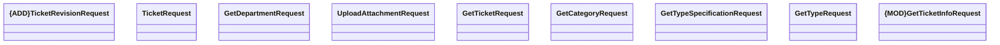

# Request Parameters

```mermaid
classDiagram
    class ADD_TicketRevisionRequest["{ADD}TicketRevisionRequest"]
    class TicketRequest["TicketRequest"]
    class GetDepartmentRequest["GetDepartmentRequest"]
    class UploadAttachmentRequest["UploadAttachmentRequest"]
    class GetTicketRequest["GetTicketRequest"]
    class GetCategoryRequest["GetCategoryRequest"]
    class GetTypeSpecificationRequest["GetTypeSpecificationRequest"]
    class GetTypeRequest["GetTypeRequest"]
    class MOD_GetTicketInfoRequest["{MOD}GetTicketInfoRequest"]
```
