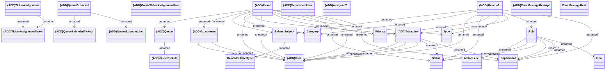

# ResponsesV2

```mermaid
classDiagram
    class Rule["Rule"]
    class Flow["Flow"]
    class ActionLabel["ActionLabel"]
    class Rule["Rule"]
    class Status["Status"]
    class RelatedSubjectType["RelatedSubjectType"]
    class RelatedSubject["RelatedSubject"]
    class Priority["Priority"]
    class Department["Department"]
    class Category["Category"]
    class ADD_User["{ADD}User"]
    class ADD_Transition["{ADD}Transition"]
    class ADD_TicketAssignmentTicket["{ADD}TicketAssignmentTicket"]
    class ADD_TicketAssignment["{ADD}TicketAssignment"]
    class ADD_QueueTickets["{ADD}QueueTickets"]
    class ADD_QueueExtendedUser["{ADD}QueueExtendedUser"]
    class ADD_QueueExtendedTickets["{ADD}QueueExtendedTickets"]
    class ADD_QueueExtended["{ADD}QueueExtended"]
    class ADD_Queue["{ADD}Queue"]
    class ADD_CreateTicketAssignmentUser["{ADD}CreateTicketAssignmentUser"]
    class ADD_Attachment["{ADD}Attachment"]
    class Type["Type"]
    class MOD_TicketInfo["{MOD}TicketInfo"]
    class ADD_DepartmentUser["{ADD}DepartmentUser"]
    class ADD_AssignedTo["{ADD}AssignedTo"]
    class ADD_Ticket["{ADD}Ticket"]
    class ADD_ErrorMessageRestApi["{ADD}ErrorMessageRestApi"]
    class ErrorMessageRest["ErrorMessageRest"]
    class ADD_TicketAssignmentTicket["{ADD}TicketAssignmentTicket"]
    class ADD_TicketAssignment["{ADD}TicketAssignment"]
    ADD_Queue --> ADD_QueueTickets : unnamed
    ADD_Ticket --> ADD_Queue : unnamed
    ADD_Ticket --> ADD_Attachment : unnamed
    ADD_Attachment --> ADD_User : unnamed
    ADD_Attachment --> ADD_User : unnamed
    Rule --> ActionLabel : unnamed
    MOD_TicketInfo --> RelatedSubject : unnamed
    RelatedSubject --> RelatedSubjectType : unnamed
    ADD_Ticket --> RelatedSubject : unnamed
    ADD_Ticket --> Category : unnamed
    MOD_TicketInfo --> Category : unnamed
    ADD_Ticket --> ADD_User : unnamed
    ADD_Ticket --> ADD_Transition : unnamed
    ADD_Ticket --> ADD_User : unnamed
    ADD_Ticket --> Priority : unnamed
    ADD_Ticket --> Type : unnamed
    ADD_Ticket --> Status : unnamed
    ADD_Ticket --> ADD_User : unnamed
    ADD_Ticket --> Department : unnamed
    ADD_QueueExtended --> ADD_QueueExtendedTickets : unnamed
    ADD_Transition --> ADD_User : unnamed
    ADD_Transition --> ADD_User : unnamed
    MOD_TicketInfo --> ADD_User : unnamed
    ADD_Transition --> ADD_User : unnamed
    ADD_TicketAssignment --> ADD_TicketAssignmentTicket : unnamed
    ADD_Transition --> Status : unnamed
    Rule --> Status : unnamed
    MOD_TicketInfo --> Status : unnamed
    Rule --> Status : unnamed
    MOD_TicketInfo --> Priority : unnamed
    MOD_TicketInfo --> Type : unnamed
    ADD_TicketAssignment --> ADD_TicketAssignmentTicket : unnamed
    ADD_Transition --> Department : unnamed
    MOD_TicketInfo --> ADD_Transition : unnamed
    MOD_TicketInfo --> Rule : unnamed
    Rule --> Department : unnamed
    Rule --> Department : unnamed
    Rule --> Flow : unnamed
    ADD_QueueExtended --> ADD_QueueExtendedUser : unnamed
    MOD_TicketInfo --> Department : unnamed
```
