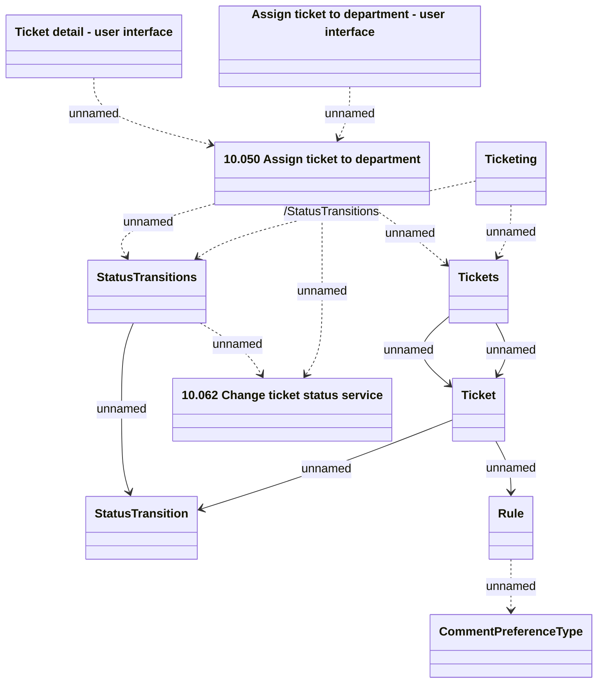

# Ticketing - Assign ticket to department API usage

- **Diagram Type**: Logical
- **Package**: HomerSelect/BSL/Modules/Ticketing (TCK)/Interface Provided/Web Services/Version 1/Operations/Ticketing - Assign ticket to department API usage
- **Diagram ID**: 159991
- **Elements**: 11
- **Connectors**: 14

