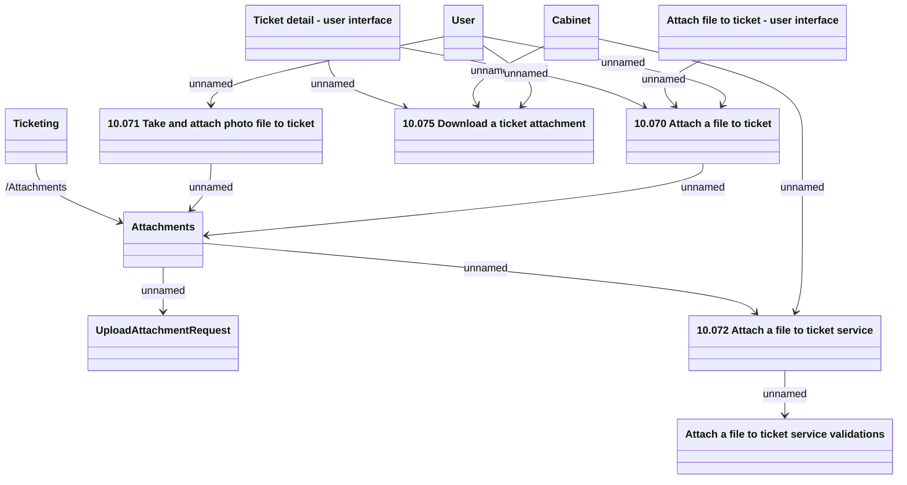

# Ticketing - Attach a file to ticket API usage

```mermaid
classDiagram
    class Attach_a_file_to_ticket_service_validations["Attach a file to ticket service validations"]
    class User["User"]
    class n_10_071_Take_and_attach_photo_file_to_ticket["10.071 Take and attach photo file to ticket"]
    class UploadAttachmentRequest["UploadAttachmentRequest"]
    class Cabinet["Cabinet"]
    class Ticketing["Ticketing"]
    class Attach_file_to_ticket_user_interface["Attach file to ticket - user interface"]
    class Ticket_detail_user_interface["Ticket detail - user interface"]
    class n_10_075_Download_a_ticket_attachment["10.075 Download a ticket attachment"]
    class n_10_072_Attach_a_file_to_ticket_service["10.072 Attach a file to ticket service"]
    class n_10_070_Attach_a_file_to_ticket["10.070 Attach a file to ticket"]
    class Attachments["Attachments"]
    Ticketing --> Attachments : /Attachments
    Ticket_detail_user_interface --> n_10_070_Attach_a_file_to_ticket : unnamed
    Attach_file_to_ticket_user_interface --> n_10_070_Attach_a_file_to_ticket : unnamed
    Attachments --> n_10_072_Attach_a_file_to_ticket_service : unnamed
    Ticket_detail_user_interface --> n_10_075_Download_a_ticket_attachment : unnamed
    Attachments --> UploadAttachmentRequest : unnamed
    n_10_071_Take_and_attach_photo_file_to_ticket --> Attachments : unnamed
    n_10_070_Attach_a_file_to_ticket --> Attachments : unnamed
    n_10_072_Attach_a_file_to_ticket_service --> Attach_a_file_to_ticket_service_validations : unnamed
    Cabinet --> n_10_072_Attach_a_file_to_ticket_service : unnamed
    Cabinet --> n_10_075_Download_a_ticket_attachment : unnamed
    User --> n_10_075_Download_a_ticket_attachment : unnamed
    User --> n_10_070_Attach_a_file_to_ticket : unnamed
    User --> n_10_071_Take_and_attach_photo_file_to_ticket : unnamed
```
