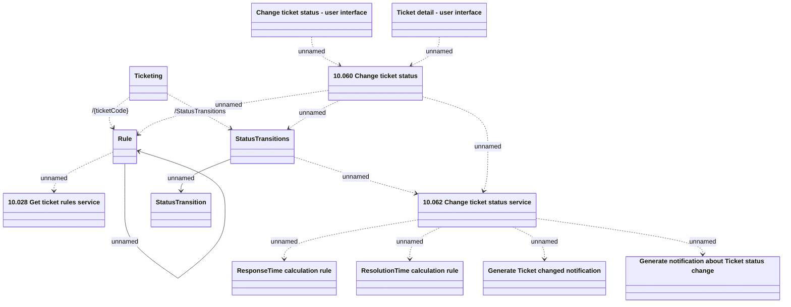

# Ticketing - Change ticket status API usage

- **Diagram Type**: Logical
- **Package**: HomerSelect/BSL/Modules/Ticketing (TCK)/Interface Provided/Web Services/Version 1/Operations/Ticketing - Change ticket status API usage
- **Diagram ID**: 159942
- **Elements**: 14
- **Connectors**: 15

