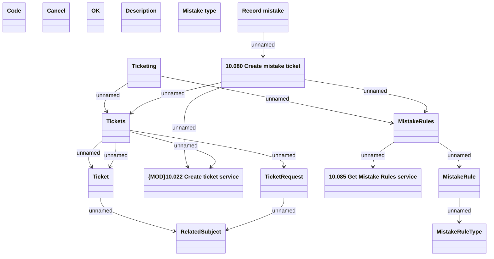

# Ticketing - Create mistake ticket API usage

```mermaid
classDiagram
    class TicketRequest["TicketRequest"]
    class Tickets["Tickets"]
    class MOD_10_022_Create_ticket_service["{MOD}10.022 Create ticket service"]
    class Code["Code"]
    class RelatedSubject["RelatedSubject"]
    class Ticket["Ticket"]
    class n_10_080_Create_mistake_ticket["10.080 Create mistake ticket"]
    class n_10_085_Get_Mistake_Rules_service["10.085 Get Mistake Rules service"]
    class MistakeRuleType["MistakeRuleType"]
    class MistakeRule["MistakeRule"]
    class MistakeRules["MistakeRules"]
    class Ticketing["Ticketing"]
    class Cancel["Cancel"]
    class OK["OK"]
    class Description["Description"]
    class Mistake_type["Mistake type"]
    class Record_mistake["Record mistake"]
    Ticketing --> MistakeRules : unnamed
    MistakeRules --> MistakeRule : unnamed
    MistakeRule --> MistakeRuleType : unnamed
    MistakeRules --> n_10_085_Get_Mistake_Rules_service : unnamed
    Record_mistake --> n_10_080_Create_mistake_ticket : unnamed
    Tickets --> Ticket : unnamed
    Tickets --> Ticket : unnamed
    Ticket --> RelatedSubject : unnamed
    TicketRequest --> RelatedSubject : unnamed
    n_10_080_Create_mistake_ticket --> MOD_10_022_Create_ticket_service : unnamed
    Tickets --> MOD_10_022_Create_ticket_service : unnamed
    Ticketing --> Tickets : unnamed
    Tickets --> TicketRequest : unnamed
    n_10_080_Create_mistake_ticket --> MistakeRules : unnamed
    n_10_080_Create_mistake_ticket --> Tickets : unnamed
```
