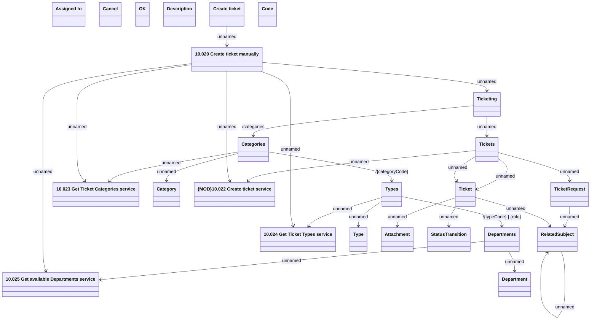

# TicketManagement - Create ticket overview

```mermaid
classDiagram
    class RelatedSubject["RelatedSubject"]
    class RelatedSubject["RelatedSubject"]
    class TicketRequest["TicketRequest"]
    class Tickets["Tickets"]
    class n_10_024_Get_Ticket_Types_service["10.024 Get Ticket Types service"]
    class n_10_023_Get_Ticket_Categories_service["10.023 Get Ticket Categories service"]
    class n_10_025_Get_available_Departments_service["10.025 Get available Departments service"]
    class Assigned_to["Assigned to"]
    class Type["Type"]
    class Category["Category"]
    class Cancel["Cancel"]
    class OK["OK"]
    class Description["Description"]
    class Create_ticket["Create ticket"]
    class n_10_020_Create_ticket_manually["10.020 Create ticket manually"]
    class MOD_10_022_Create_ticket_service["{MOD}10.022 Create ticket service"]
    class Attachment["Attachment"]
    class StatusTransition["StatusTransition"]
    class Code["Code"]
    class Ticket["Ticket"]
    class Departments["Departments"]
    class Department["Department"]
    class Type["Type"]
    class Category["Category"]
    class Ticketing["Ticketing"]
    class Types["Types"]
    class Categories["Categories"]
    Tickets --> MOD_10_022_Create_ticket_service : unnamed
    TicketRequest --> RelatedSubject : unnamed
    RelatedSubject --> RelatedSubject : unnamed
    Tickets --> TicketRequest : unnamed
    Ticketing --> Tickets : unnamed
    Types --> n_10_024_Get_Ticket_Types_service : unnamed
    Categories --> n_10_023_Get_Ticket_Categories_service : unnamed
    Departments --> n_10_025_Get_available_Departments_service : unnamed
    Ticket --> RelatedSubject : unnamed
    Ticketing --> Categories : /categories
    Ticket --> Attachment : unnamed
    Ticket --> StatusTransition : unnamed
    Tickets --> Ticket : unnamed
    Tickets --> Ticket : unnamed
    Types --> Departments : /{typeCode} | {role}
    Departments --> Department : unnamed
    Types --> Type : unnamed
    Categories --> Category : unnamed
    Categories --> Types : /{categoryCode}
    Create_ticket --> n_10_020_Create_ticket_manually : unnamed
    n_10_020_Create_ticket_manually --> n_10_024_Get_Ticket_Types_service : unnamed
    n_10_020_Create_ticket_manually --> n_10_025_Get_available_Departments_service : unnamed
    n_10_020_Create_ticket_manually --> n_10_023_Get_Ticket_Categories_service : unnamed
    n_10_020_Create_ticket_manually --> MOD_10_022_Create_ticket_service : unnamed
    n_10_020_Create_ticket_manually --> Ticketing : unnamed
```
