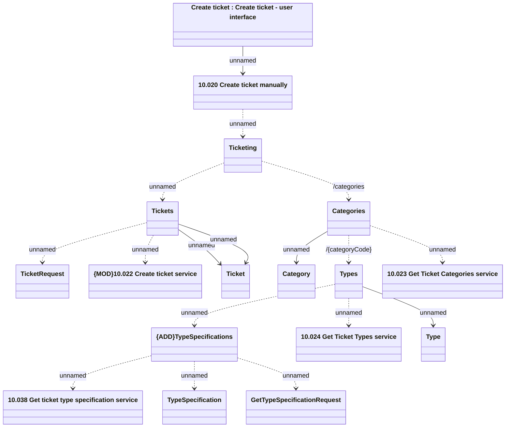

# Ticketing - Create ticket overview (with TypeSpecification)

- **Diagram Type**: Logical
- **Package**: HomerSelect/BSL/Modules/Ticketing (TCK)/Interface Provided/Web Services/Version 1/Operations/Ticketing - Create ticket API usage
- **Diagram ID**: 160001
- **Elements**: 17
- **Connectors**: 17

