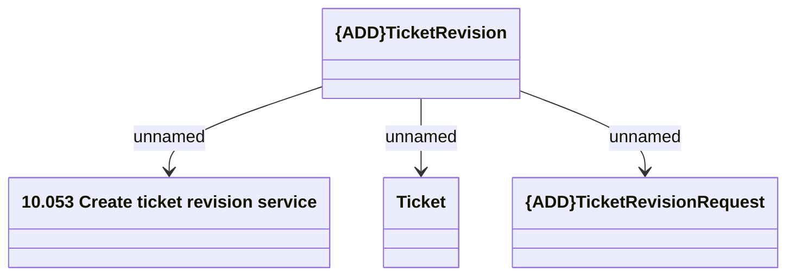

# Ticketing - Create ticket revision

```mermaid
classDiagram
    class ADD_TicketRevisionRequest["{ADD}TicketRevisionRequest"]
    class Ticket["Ticket"]
    class n_10_053_Create_ticket_revision_service["10.053 Create ticket revision service"]
    class ADD_TicketRevision["{ADD}TicketRevision"]
    ADD_TicketRevision --> n_10_053_Create_ticket_revision_service : unnamed
    ADD_TicketRevision --> Ticket : unnamed
    ADD_TicketRevision --> ADD_TicketRevisionRequest : unnamed
```
