# Ticketing - Get Ticket details

- **Diagram Type**: Logical
- **Package**: HomerSelect/BSL/Modules/Ticketing (TCK)/Interface Provided/Web Services/Version 1/Operations/Ticketing - Get Ticket details
- **Diagram ID**: 160005
- **Elements**: 12
- **Connectors**: 13

```mermaid
classDiagram
    class Attachment["Attachment"]
    class StatusTransition["StatusTransition"]
    class RelatedSubject["RelatedSubject"]
    class GetTicketRequest["GetTicketRequest"]
    class n_10_028_Get_ticket_rules_service["10.028 Get ticket rules service"]
    class Rule["Rule"]
    class Rule["Rule"]
    class Ticket_detail_user_interface["Ticket detail - user interface"]
    class n_10_030_Show_ticket_detail["10.030 Show ticket detail"]
    class n_10_032_Show_ticket_detail_service["10.032 Show ticket detail service"]
    class Ticket["Ticket"]
    class Tickets["Tickets"]
    Tickets --> Ticket : unnamed
    Tickets --> Ticket : unnamed
    Tickets ..> n_10_032_Show_ticket_detail_service : unnamed
    Ticket_detail_user_interface ..> n_10_030_Show_ticket_detail : unnamed
    Rule --> Rule : unnamed
    Ticket --> Rule : unnamed
    Rule ..> n_10_028_Get_ticket_rules_service : unnamed
    Tickets --> GetTicketRequest : unnamed
    Ticket --> RelatedSubject : unnamed
    Ticket --> StatusTransition : unnamed
    Ticket --> Attachment : unnamed
    n_10_030_Show_ticket_detail ..> Tickets : unnamed
    n_10_030_Show_ticket_detail ..> Rule : unnamed
```

