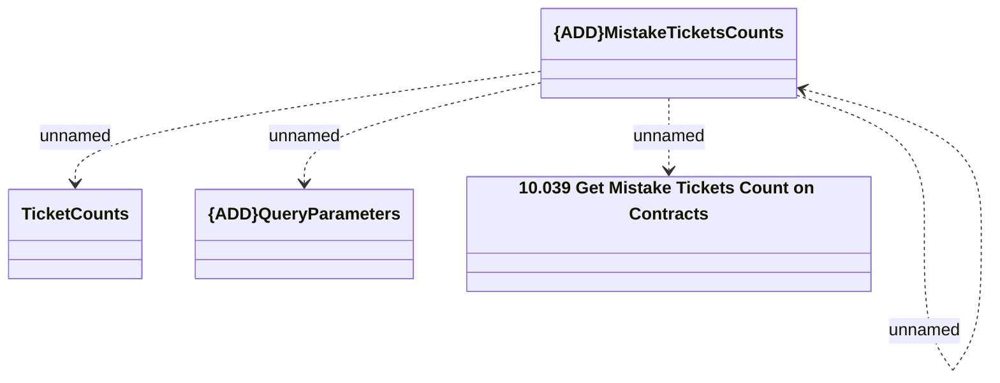

# Ticketing - Get mistake tickets count on contracts

- **Diagram Type**: Logical
- **Package**: HomerSelect/BSL/Modules/Ticketing (TCK)/Interface Provided/Web Services/Version 1/Operations/Ticketing - Get mistake tickets count on contracts
- **Diagram ID**: 160003
- **Elements**: 5
- **Connectors**: 4

