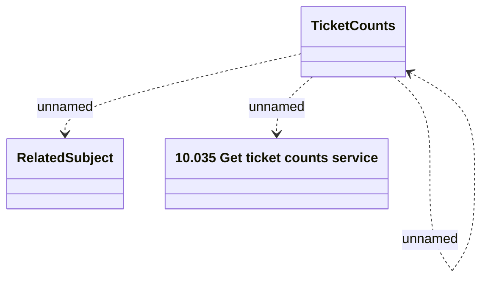

# Ticketing - Get ticket counts

- **Diagram Type**: Logical
- **Package**: HomerSelect/BSL/Modules/Ticketing (TCK)/Interface Provided/Web Services/Version 1/Operations/Ticketing - Get ticket counts
- **Diagram ID**: 160004
- **Elements**: 4
- **Connectors**: 3

