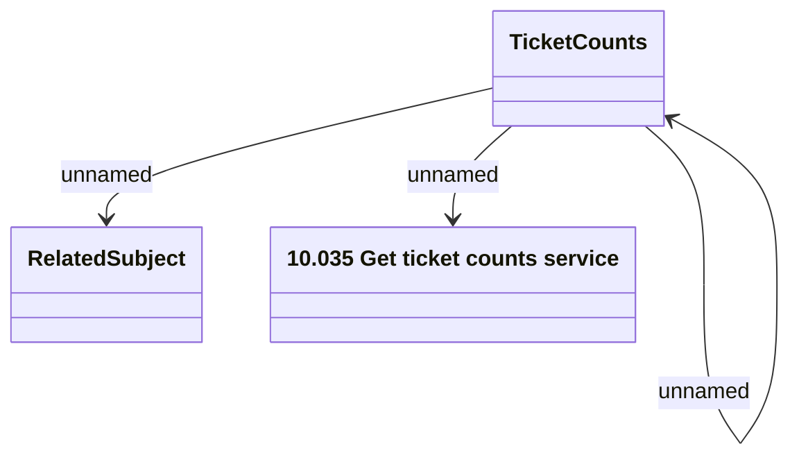

# Ticketing - Get ticket counts

```mermaid
classDiagram
    class RelatedSubject["RelatedSubject"]
    class TicketCounts["TicketCounts"]
    class n_10_035_Get_ticket_counts_service["10.035 Get ticket counts service"]
    class TicketCounts["TicketCounts"]
    TicketCounts --> n_10_035_Get_ticket_counts_service : unnamed
    TicketCounts --> TicketCounts : unnamed
    TicketCounts --> RelatedSubject : unnamed
```
