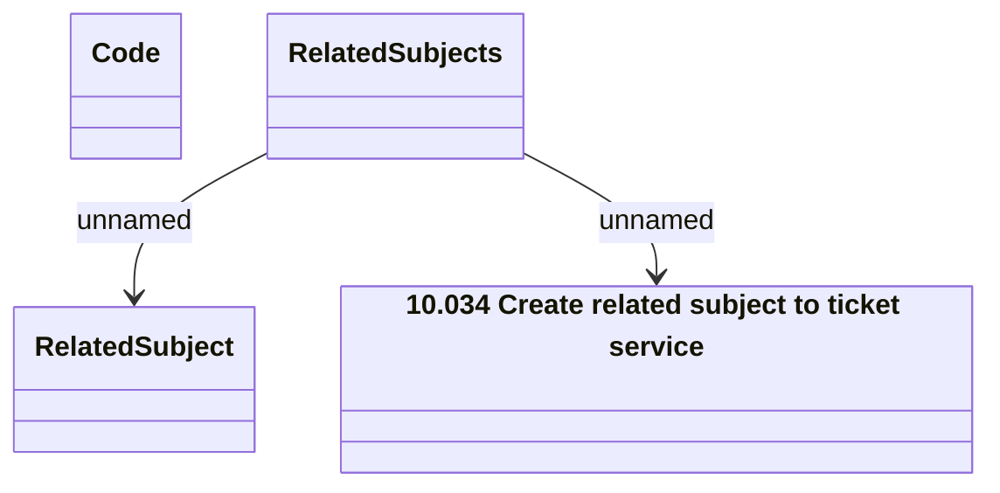

# Ticketing - Related subjects API usage

```mermaid
classDiagram
    class Code["Code"]
    class n_10_034_Create_related_subject_to_ticket_service["10.034 Create related subject to ticket service"]
    class RelatedSubjects["RelatedSubjects"]
    class RelatedSubject["RelatedSubject"]
    RelatedSubjects --> RelatedSubject : unnamed
    RelatedSubjects --> n_10_034_Create_related_subject_to_ticket_service : unnamed
```
