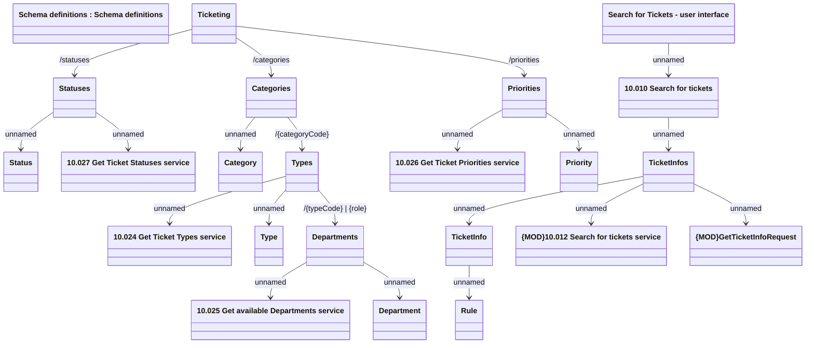

# Ticketing - search for ticket usage

```mermaid
classDiagram
    class MOD_GetTicketInfoRequest["{MOD}GetTicketInfoRequest"]
    class n_10_024_Get_Ticket_Types_service["10.024 Get Ticket Types service"]
    class n_10_025_Get_available_Departments_service["10.025 Get available Departments service"]
    class TicketInfo["TicketInfo"]
    class Rule["Rule"]
    class Schema_definitions_Schema_definitions["Schema definitions : Schema definitions"]
    class n_10_010_Search_for_tickets["10.010 Search for tickets"]
    class MOD_10_012_Search_for_tickets_service["{MOD}10.012 Search for tickets service"]
    class n_10_026_Get_Ticket_Priorities_service["10.026 Get Ticket Priorities service"]
    class n_10_027_Get_Ticket_Statuses_service["10.027 Get Ticket Statuses service"]
    class Statuses["Statuses"]
    class Status["Status"]
    class Search_for_Tickets_user_interface["Search for Tickets - user interface"]
    class Priority["Priority"]
    class Priorities["Priorities"]
    class Department["Department"]
    class Type["Type"]
    class Category["Category"]
    class TicketInfos["TicketInfos"]
    class Departments["Departments"]
    class Ticketing["Ticketing"]
    class Types["Types"]
    class Categories["Categories"]
    Statuses --> Status : unnamed
    Types --> n_10_024_Get_Ticket_Types_service : unnamed
    Departments --> n_10_025_Get_available_Departments_service : unnamed
    TicketInfos --> TicketInfo : unnamed
    TicketInfo --> Rule : unnamed
    Search_for_Tickets_user_interface --> n_10_010_Search_for_tickets : unnamed
    TicketInfos --> MOD_10_012_Search_for_tickets_service : unnamed
    Priorities --> n_10_026_Get_Ticket_Priorities_service : unnamed
    TicketInfos --> MOD_GetTicketInfoRequest : unnamed
    Ticketing --> Statuses : /statuses
    Ticketing --> Categories : /categories
    Priorities --> Priority : unnamed
    Ticketing --> Priorities : /priorities
    Departments --> Department : unnamed
    Types --> Type : unnamed
    Categories --> Category : unnamed
    Types --> Departments : /{typeCode} | {role}
    Categories --> Types : /{categoryCode}
    Statuses --> n_10_027_Get_Ticket_Statuses_service : unnamed
    n_10_010_Search_for_tickets --> TicketInfos : unnamed
```
