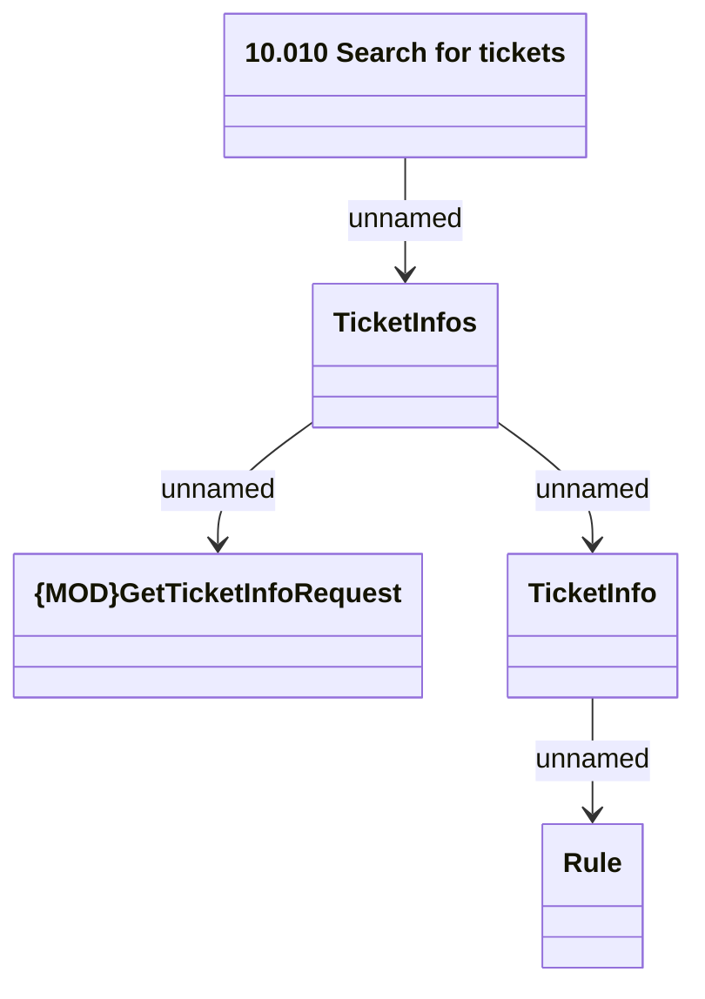

# Ticketing - Ticket infos

```mermaid
classDiagram
    class n_10_010_Search_for_tickets["10.010 Search for tickets"]
    class MOD_GetTicketInfoRequest["{MOD}GetTicketInfoRequest"]
    class TicketInfo["TicketInfo"]
    class Rule["Rule"]
    class TicketInfos["TicketInfos"]
    TicketInfo --> Rule : unnamed
    TicketInfos --> TicketInfo : unnamed
    TicketInfos --> MOD_GetTicketInfoRequest : unnamed
    n_10_010_Search_for_tickets --> TicketInfos : unnamed
```
