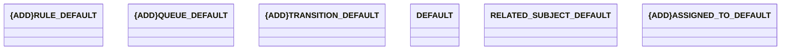

# Projections

- **Diagram Type**: Logical
- **Package**: HomerSelect/BSL/Modules/Ticketing (TCK)/Interface Provided/Web Services/Version 1/Operations/Ticketing - Ticket infos/v2.0/Projections
- **Diagram ID**: 160010
- **Elements**: 6
- **Connectors**: 0

