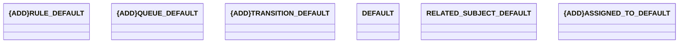

# Projections

```mermaid
classDiagram
    class ADD_RULE_DEFAULT["{ADD}RULE_DEFAULT"]
    class ADD_QUEUE_DEFAULT["{ADD}QUEUE_DEFAULT"]
    class ADD_TRANSITION_DEFAULT["{ADD}TRANSITION_DEFAULT"]
    class DEFAULT["DEFAULT"]
    class RELATED_SUBJECT_DEFAULT["RELATED_SUBJECT_DEFAULT"]
    class ADD_ASSIGNED_TO_DEFAULT["{ADD}ASSIGNED_TO_DEFAULT"]
```
