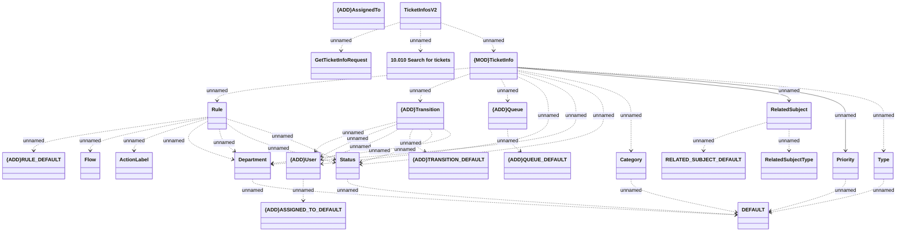

# Ticketing - Ticket infos v2

- **Diagram Type**: Logical
- **Package**: HomerSelect/BSL/Modules/Ticketing (TCK)/Interface Provided/Web Services/Version 1/Operations/Ticketing - Ticket infos/v2.0
- **Diagram ID**: 162957
- **Elements**: 24
- **Connectors**: 35

