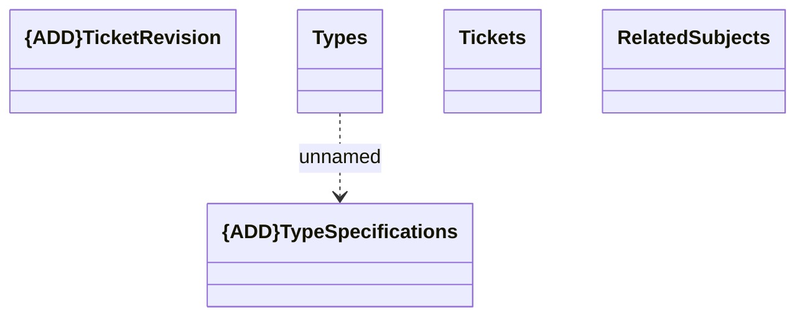

# Resources

- **Diagram Type**: Logical
- **Package**: HomerSelect/BSL/Modules/Ticketing (TCK)/Interface Provided/Web Services/Version 1/Resources
- **Diagram ID**: 159993
- **Elements**: 5
- **Connectors**: 1

