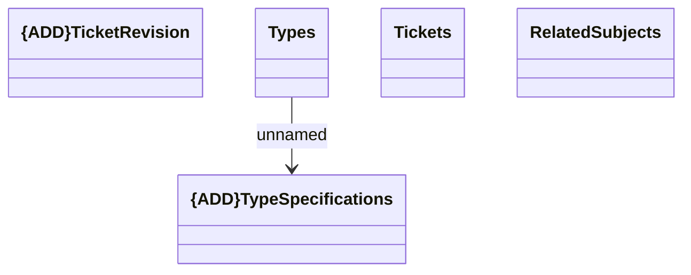

# Resources

```mermaid
classDiagram
    class ADD_TicketRevision["{ADD}TicketRevision"]
    class ADD_TypeSpecifications["{ADD}TypeSpecifications"]
    class Types["Types"]
    class Tickets["Tickets"]
    class RelatedSubjects["RelatedSubjects"]
    Types --> ADD_TypeSpecifications : unnamed
```
