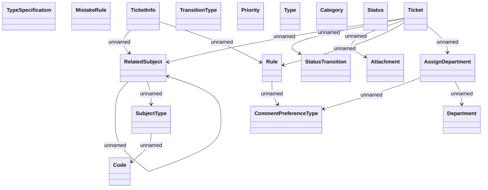

# Schema definitions

```mermaid
classDiagram
    class SubjectType["SubjectType"]
    class RelatedSubject["RelatedSubject"]
    class AssignDepartment["AssignDepartment"]
    class TypeSpecification["TypeSpecification"]
    class MistakeRule["MistakeRule"]
    class Department["Department"]
    class TicketInfo["TicketInfo"]
    class TransitionType["TransitionType"]
    class Code["Code"]
    class CommentPreferenceType["CommentPreferenceType"]
    class Priority["Priority"]
    class Rule["Rule"]
    class Type["Type"]
    class Category["Category"]
    class Status["Status"]
    class Attachment["Attachment"]
    class StatusTransition["StatusTransition"]
    class RelatedSubject["RelatedSubject"]
    class Ticket["Ticket"]
    RelatedSubject --> RelatedSubject : unnamed
    TicketInfo --> RelatedSubject : unnamed
    Ticket --> RelatedSubject : unnamed
    Ticket --> StatusTransition : unnamed
    Ticket --> Attachment : unnamed
    TicketInfo --> Rule : unnamed
    Ticket --> Rule : unnamed
    AssignDepartment --> CommentPreferenceType : unnamed
    Rule --> CommentPreferenceType : unnamed
    SubjectType --> Code : unnamed
    AssignDepartment --> Department : unnamed
    Ticket --> AssignDepartment : unnamed
    RelatedSubject --> SubjectType : unnamed
```
