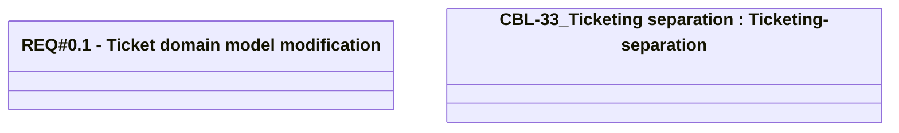

# Ticketing domain model modification

- **Diagram Type**: Logical
- **Package**: HomerSelect/BSL/Modules/Ticketing (TCK)/Requirements/CBL-33_Ticketing separation/REQ#0.1 - Ticketing domain model modification
- **Diagram ID**: 156081
- **Elements**: 3
- **Connectors**: 0

