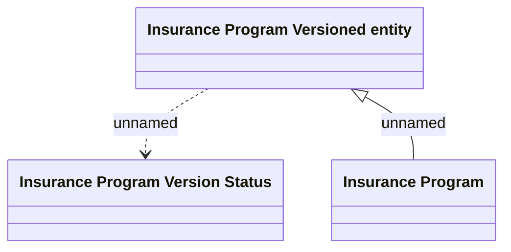

# Insurance Program versions

- **Diagram Type**: Logical
- **Package**: HomerSelect/BSL/Modules/Value Added Services (VAS)/Analytical Model/Insurance Program/Insurance Program management/Logical Data Model
- **Diagram ID**: 164329
- **Elements**: 3
- **Connectors**: 2

