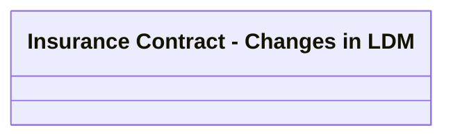

# BSL Insurance Contract

- **Diagram Type**: Logical
- **Package**: HomerSelect/BSL/Modules/Value Added Services (VAS)/Analytical Model/VAS Deal/Logical Data Model
- **Diagram ID**: 142887
- **Elements**: 1
- **Connectors**: 0

