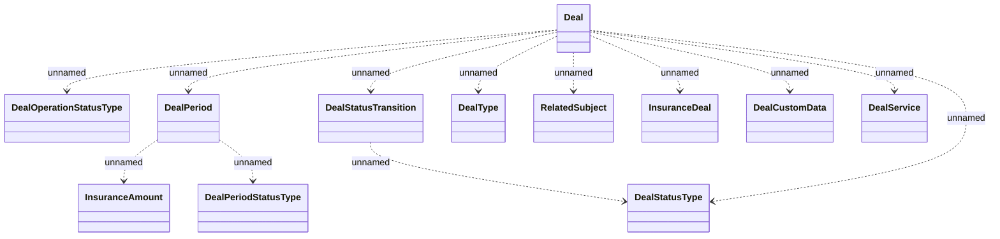

# Deal

- **Diagram Type**: Logical
- **Package**: HomerSelect/BSL/Modules/Value Added Services (VAS)/Interface Provided/Generated messages/Data streaming/Deal
- **Diagram ID**: 147092
- **Elements**: 12
- **Connectors**: 12

