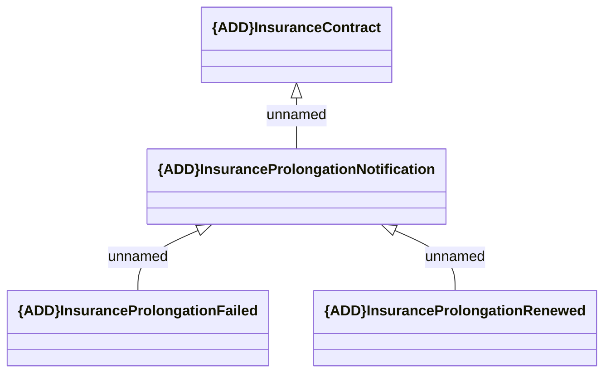

# DealProlongationNotification

- **Diagram Type**: Logical
- **Package**: HomerSelect/BSL/Modules/Value Added Services (VAS)/Interface Provided/Generated messages/DealProlongationNotification
- **Diagram ID**: 156547
- **Elements**: 4
- **Connectors**: 3

