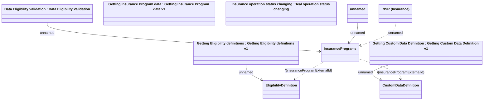

# Web Services - Resource overview

- **Diagram Type**: Logical
- **Package**: HomerSelect/BSL/Modules/Value Added Services (VAS)/Interface Provided/Web Services
- **Diagram ID**: 142892
- **Elements**: 10
- **Connectors**: 7

