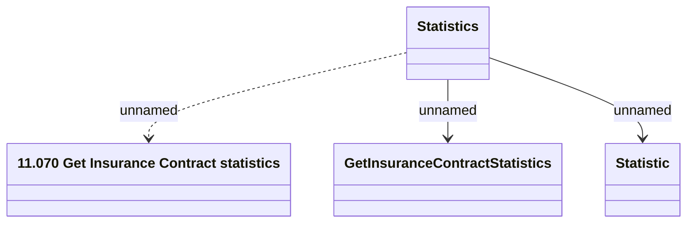

# Getting Insurance Contract statistics

- **Diagram Type**: Logical
- **Package**: HomerSelect/BSL/Modules/Value Added Services (VAS)/Interface Provided/Web Services/Getting Insurance Contract statistics
- **Diagram ID**: 142930
- **Elements**: 4
- **Connectors**: 3

