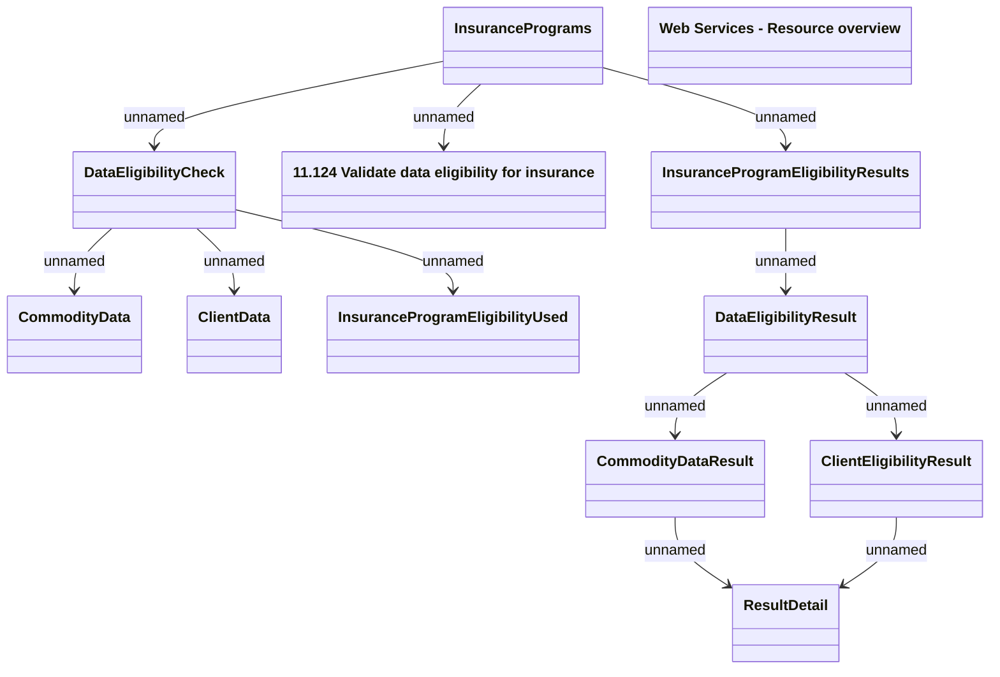

# Data Eligibility Validation

```mermaid
classDiagram
    class InsuranceProgramEligibilityResults["InsuranceProgramEligibilityResults"]
    class InsuranceProgramEligibilityUsed["InsuranceProgramEligibilityUsed"]
    class InsurancePrograms["InsurancePrograms"]
    class n_11_124_Validate_data_eligibility_for_insurance["11.124 Validate data eligibility for insurance"]
    class CommodityDataResult["CommodityDataResult"]
    class ResultDetail["ResultDetail"]
    class ClientEligibilityResult["ClientEligibilityResult"]
    class DataEligibilityResult["DataEligibilityResult"]
    class ClientData["ClientData"]
    class Web_Services_Resource_overview["Web Services - Resource overview"]
    class DataEligibilityCheck["DataEligibilityCheck"]
    class CommodityData["CommodityData"]
    DataEligibilityCheck --> CommodityData : unnamed
    DataEligibilityCheck --> ClientData : unnamed
    DataEligibilityCheck --> InsuranceProgramEligibilityUsed : unnamed
    ClientEligibilityResult --> ResultDetail : unnamed
    CommodityDataResult --> ResultDetail : unnamed
    DataEligibilityResult --> CommodityDataResult : unnamed
    InsuranceProgramEligibilityResults --> DataEligibilityResult : unnamed
    DataEligibilityResult --> ClientEligibilityResult : unnamed
    InsurancePrograms --> DataEligibilityCheck : unnamed
    InsurancePrograms --> n_11_124_Validate_data_eligibility_for_insurance : unnamed
    InsurancePrograms --> InsuranceProgramEligibilityResults : unnamed
```
