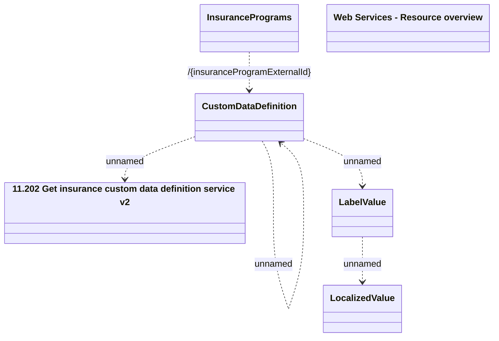

# Getting Custom Data Definition v1

- **Diagram Type**: Logical
- **Package**: HomerSelect/BSL/Modules/Value Added Services (VAS)/Interface Provided/Web Services/Insurance Program Services/Operations/Getting Custom Data Definition
- **Diagram ID**: 134363
- **Elements**: 7
- **Connectors**: 5

