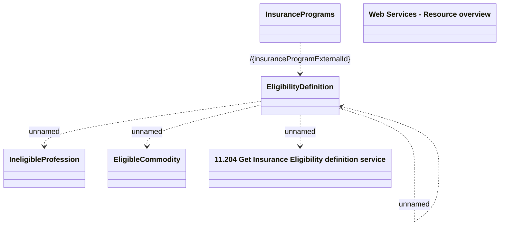

# Getting Eligibility definitions v1

- **Diagram Type**: Logical
- **Package**: HomerSelect/BSL/Modules/Value Added Services (VAS)/Interface Provided/Web Services/Insurance Program Services/Operations/Getting Eligibility definitions
- **Diagram ID**: 134365
- **Elements**: 7
- **Connectors**: 5

