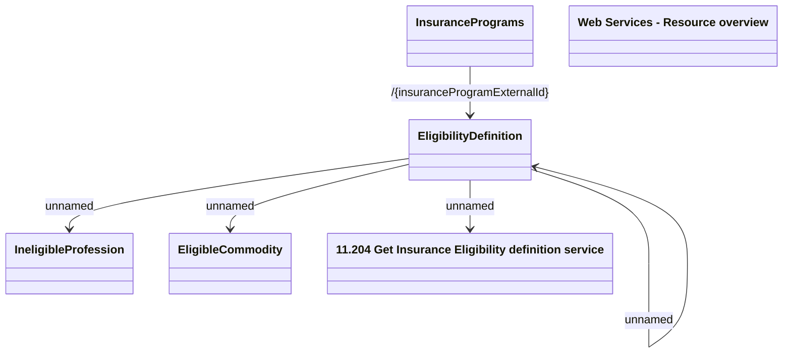

# Getting Eligibility definitions v1

```mermaid
classDiagram
    class EligibilityDefinition["EligibilityDefinition"]
    class InsurancePrograms["InsurancePrograms"]
    class IneligibleProfession["IneligibleProfession"]
    class EligibleCommodity["EligibleCommodity"]
    class Web_Services_Resource_overview["Web Services - Resource overview"]
    class n_11_204_Get_Insurance_Eligibility_definition_service["11.204 Get Insurance Eligibility definition service"]
    class EligibilityDefinition["EligibilityDefinition"]
    InsurancePrograms --> EligibilityDefinition : /{insuranceProgramExternalId}
    EligibilityDefinition --> EligibilityDefinition : unnamed
    EligibilityDefinition --> n_11_204_Get_Insurance_Eligibility_definition_service : unnamed
    EligibilityDefinition --> IneligibleProfession : unnamed
    EligibilityDefinition --> EligibleCommodity : unnamed
```
