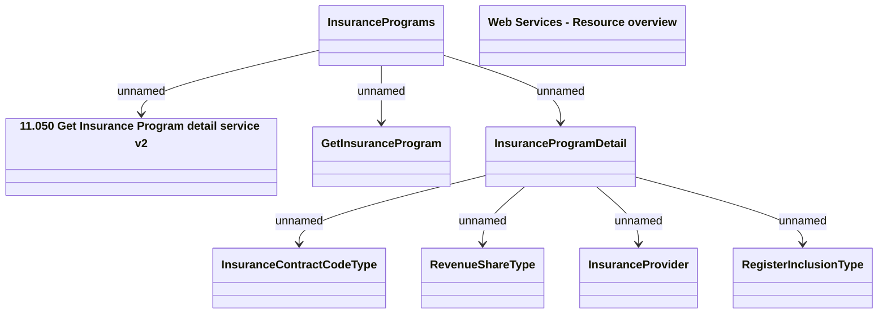

# Getting Insurance Program data v1

```mermaid
classDiagram
    class InsuranceContractCodeType["InsuranceContractCodeType"]
    class RegisterInclusionType["RegisterInclusionType"]
    class RevenueShareType["RevenueShareType"]
    class InsurancePrograms["InsurancePrograms"]
    class n_11_050_Get_Insurance_Program_detail_service_v2["11.050 Get Insurance Program detail service v2"]
    class Web_Services_Resource_overview["Web Services - Resource overview"]
    class InsuranceProvider["InsuranceProvider"]
    class GetInsuranceProgram["GetInsuranceProgram"]
    class InsuranceProgramDetail["InsuranceProgramDetail"]
    InsurancePrograms --> GetInsuranceProgram : unnamed
    InsurancePrograms --> InsuranceProgramDetail : unnamed
    InsurancePrograms --> n_11_050_Get_Insurance_Program_detail_service_v2 : unnamed
    InsuranceProgramDetail --> InsuranceContractCodeType : unnamed
    InsuranceProgramDetail --> RevenueShareType : unnamed
    InsuranceProgramDetail --> InsuranceProvider : unnamed
    InsuranceProgramDetail --> RegisterInclusionType : unnamed
```
