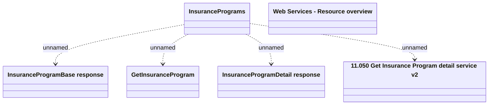

# Getting Insurance Program data v2

- **Diagram Type**: Logical
- **Package**: HomerSelect/BSL/Modules/Value Added Services (VAS)/Interface Provided/Web Services/Insurance Program Services/Operations/Getting Insurance Program data
- **Diagram ID**: 141468
- **Elements**: 6
- **Connectors**: 4

