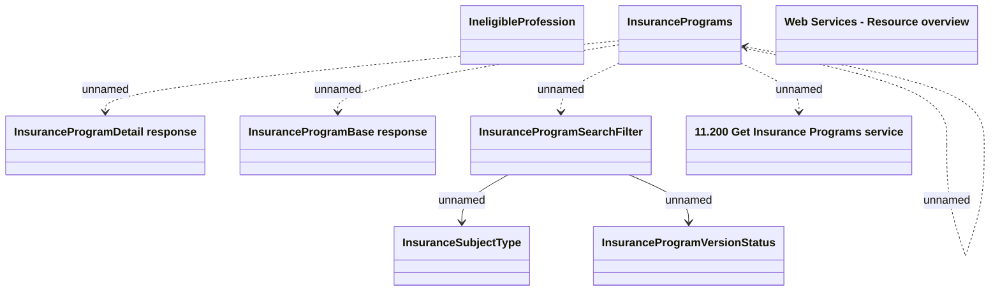

# Getting Insurance Programs v2

- **Diagram Type**: Logical
- **Package**: HomerSelect/BSL/Modules/Value Added Services (VAS)/Interface Provided/Web Services/Insurance Program Services/Operations/Getting Insurance Programs by search criteria
- **Diagram ID**: 141466
- **Elements**: 10
- **Connectors**: 7

