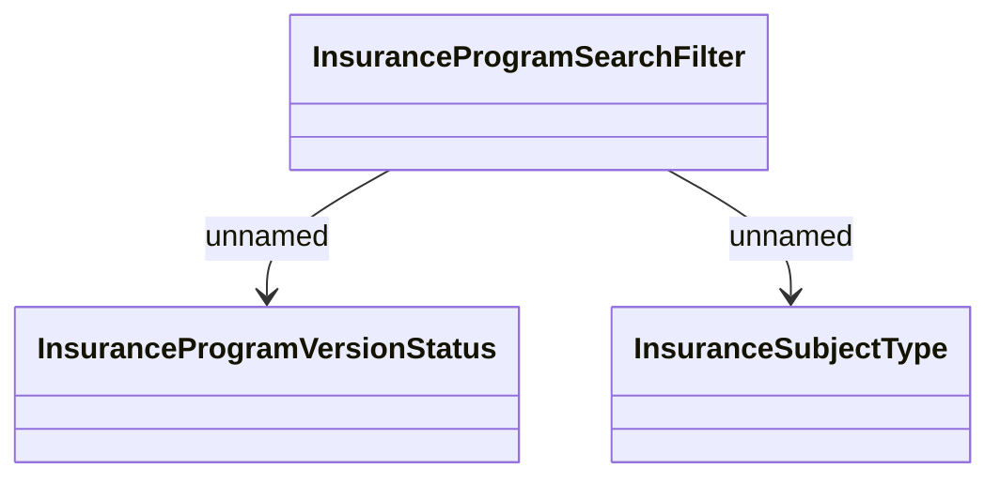

# Request Parameters

```mermaid
classDiagram
    class InsuranceSubjectType["InsuranceSubjectType"]
    class InsuranceProgramVersionStatus["InsuranceProgramVersionStatus"]
    class InsuranceProgramSearchFilter["InsuranceProgramSearchFilter"]
    InsuranceProgramSearchFilter --> InsuranceProgramVersionStatus : unnamed
    InsuranceProgramSearchFilter --> InsuranceSubjectType : unnamed
```
