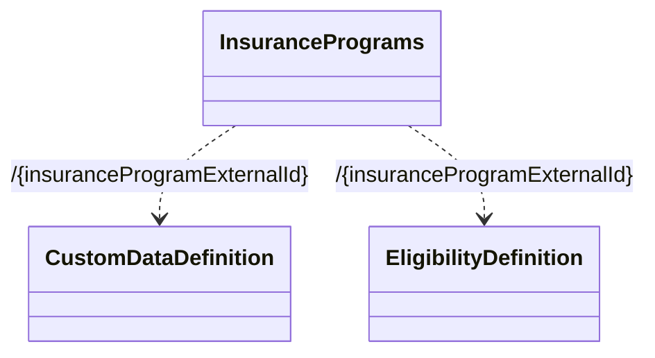

# Resources

- **Diagram Type**: Logical
- **Package**: HomerSelect/BSL/Modules/Value Added Services (VAS)/Interface Provided/Web Services/Insurance Program Services/Resources
- **Diagram ID**: 146577
- **Elements**: 3
- **Connectors**: 2

