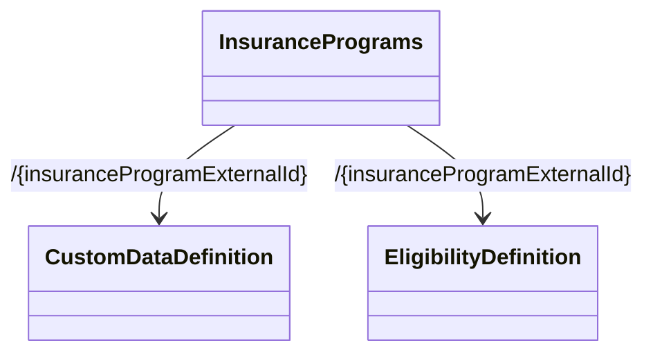

# Resources

```mermaid
classDiagram
    class EligibilityDefinition["EligibilityDefinition"]
    class CustomDataDefinition["CustomDataDefinition"]
    class InsurancePrograms["InsurancePrograms"]
    InsurancePrograms --> CustomDataDefinition : /{insuranceProgramExternalId}
    InsurancePrograms --> EligibilityDefinition : /{insuranceProgramExternalId}
```
