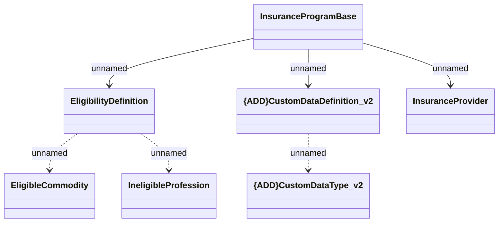

# InsuranceProgramBase response

- **Diagram Type**: Logical
- **Package**: HomerSelect/BSL/Modules/Value Added Services (VAS)/Interface Provided/Web Services/Insurance Program Services/Schema definitions
- **Diagram ID**: 146575
- **Elements**: 7
- **Connectors**: 6

