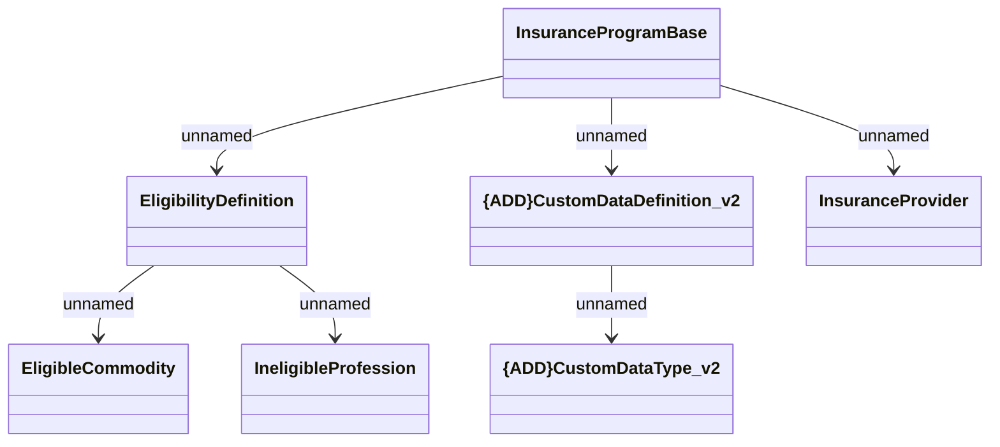

# InsuranceProgramBase response

```mermaid
classDiagram
    class ADD_CustomDataType_v2["{ADD}CustomDataType_v2"]
    class ADD_CustomDataDefinition_v2["{ADD}CustomDataDefinition_v2"]
    class InsuranceProgramBase["InsuranceProgramBase"]
    class IneligibleProfession["IneligibleProfession"]
    class EligibleCommodity["EligibleCommodity"]
    class EligibilityDefinition["EligibilityDefinition"]
    class InsuranceProvider["InsuranceProvider"]
    InsuranceProgramBase --> InsuranceProvider : unnamed
    InsuranceProgramBase --> EligibilityDefinition : unnamed
    EligibilityDefinition --> EligibleCommodity : unnamed
    EligibilityDefinition --> IneligibleProfession : unnamed
    InsuranceProgramBase --> ADD_CustomDataDefinition_v2 : unnamed
    ADD_CustomDataDefinition_v2 --> ADD_CustomDataType_v2 : unnamed
```
