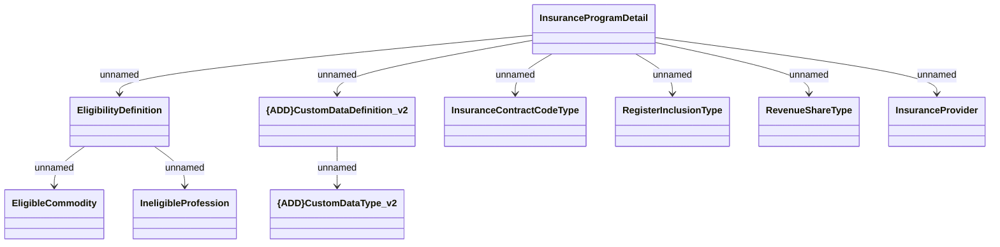

# InsuranceProgramDetail response

```mermaid
classDiagram
    class ADD_CustomDataType_v2["{ADD}CustomDataType_v2"]
    class ADD_CustomDataDefinition_v2["{ADD}CustomDataDefinition_v2"]
    class IneligibleProfession["IneligibleProfession"]
    class EligibleCommodity["EligibleCommodity"]
    class EligibilityDefinition["EligibilityDefinition"]
    class InsuranceContractCodeType["InsuranceContractCodeType"]
    class RegisterInclusionType["RegisterInclusionType"]
    class RevenueShareType["RevenueShareType"]
    class InsuranceProvider["InsuranceProvider"]
    class InsuranceProgramDetail["InsuranceProgramDetail"]
    InsuranceProgramDetail --> InsuranceProvider : unnamed
    InsuranceProgramDetail --> RevenueShareType : unnamed
    InsuranceProgramDetail --> RegisterInclusionType : unnamed
    InsuranceProgramDetail --> InsuranceContractCodeType : unnamed
    InsuranceProgramDetail --> EligibilityDefinition : unnamed
    EligibilityDefinition --> EligibleCommodity : unnamed
    EligibilityDefinition --> IneligibleProfession : unnamed
    InsuranceProgramDetail --> ADD_CustomDataDefinition_v2 : unnamed
    ADD_CustomDataDefinition_v2 --> ADD_CustomDataType_v2 : unnamed
```
