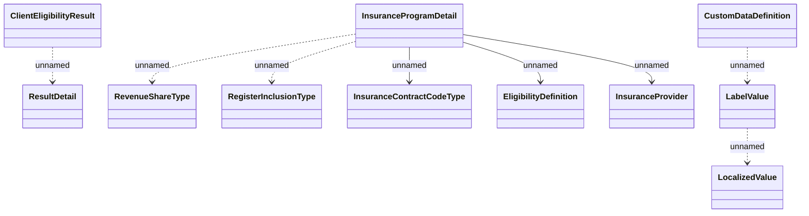

# Schema definitions

- **Diagram Type**: Logical
- **Package**: HomerSelect/BSL/Modules/Value Added Services (VAS)/Interface Provided/Web Services/Insurance Program Services/Schema definitions
- **Diagram ID**: 146574
- **Elements**: 12
- **Connectors**: 8

