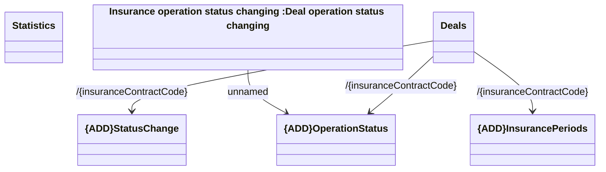

# Resources

```mermaid
classDiagram
    class Statistics["Statistics"]
    class ADD_InsurancePeriods["{ADD}InsurancePeriods"]
    class ADD_StatusChange["{ADD}StatusChange"]
    class ADD_OperationStatus["{ADD}OperationStatus"]
    class Deals["Deals"]
    class Insurance_operation_status_changing_Deal_operation_status_ch["Insurance operation status changing :Deal operation status changing"]
    Insurance_operation_status_changing_Deal_operation_status_ch --> ADD_OperationStatus : unnamed
    Deals --> ADD_StatusChange : /{insuranceContractCode}
    Deals --> ADD_OperationStatus : /{insuranceContractCode}
    Deals --> ADD_InsurancePeriods : /{insuranceContractCode}
```
